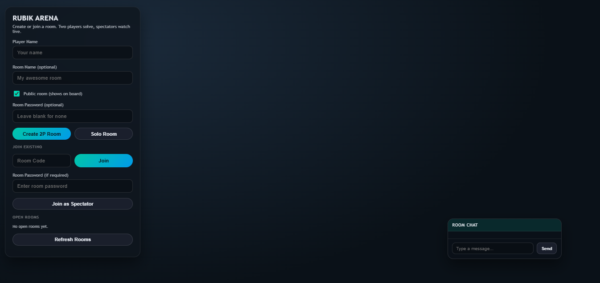
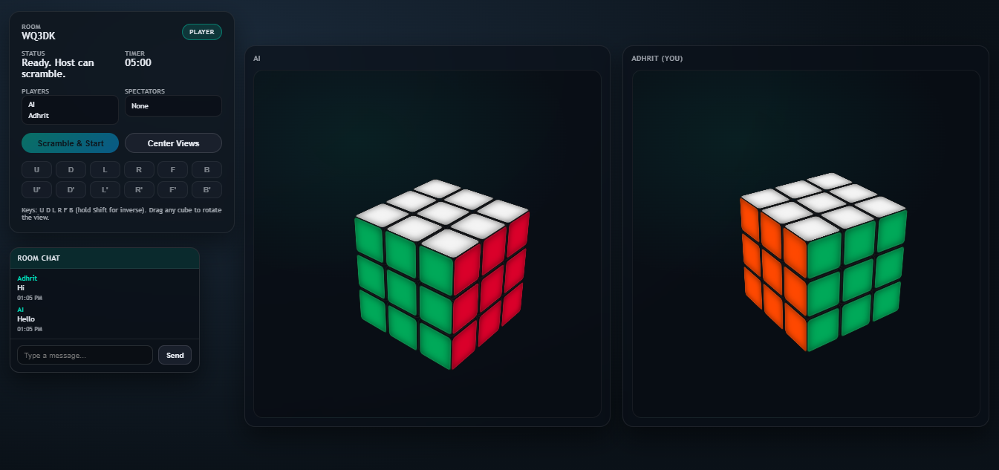

# Rubik Arena

A real-time multiplayer Rubik's Cube arena with solo and 2-player rooms, spectators, live chat, and timed rounds.

## Preview

**Lobby / Room Board**



**In-Room Match View**



## Features

- Create solo or 2-player rooms
- Public or private rooms with optional password
- Room board with live availability
- Separate cube per player (spectators see both)
- 5-minute timed rounds with win/draw/no-winner logic
- Drag-to-rotate 3D cubes
- Draggable in-room chat with saved history

## Run Locally

```powershell
cd /d C:\Users\Administrator\OneDrive\Documents\CodeX[30]
node server.js
```

Open `http://localhost:3000` in your browser.

## Notes

Chat history is stored in `data/chat-<ROOMCODE>.json` and keeps the last 100 messages per room.
